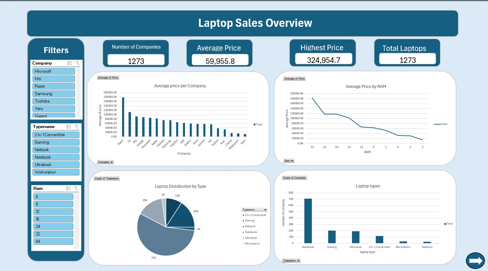
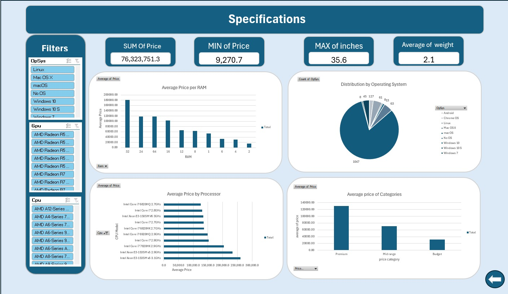

Laptop Data Analysis Dashboard

 📌 Project Overview
This project presents an interactive dashboard built using Microsoft Excel to analyze laptop data and provide valuable insights into pricing, specifications, and laptop categories.

 🛠️ Tools Used
- Microsoft Excel
- Pivot Tables
- Pivot Charts
- Slicers

 📊 Dashboard Features
- Total Laptops
- Average Price
- Highest Price
- Average Price by Company
- Average Price by RAM
- Laptop Distribution by Type
- Interactive Filters

 📷 Dashboard Preview

 Overview Dashboard

 Specifications Dashboard

